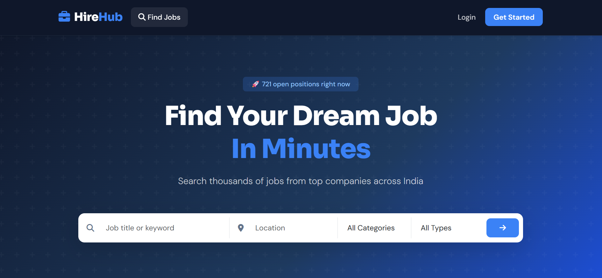
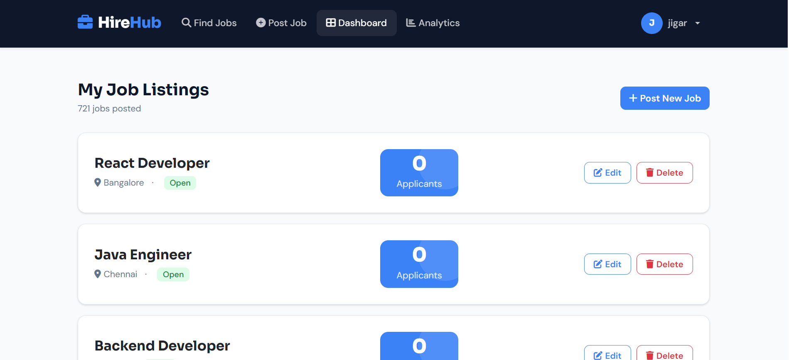
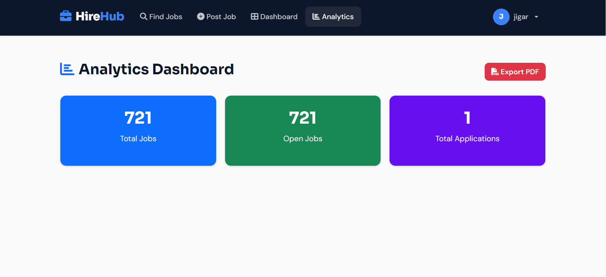

# 💼 Job Portal - Django

A modern job portal web application built using Django, designed to simplify the hiring process for job seekers and employers.

---

## 🚀 Live Demo

🌐 **Deployed App (Render):** https://jobportalhost.onrender.com/

💻 **Source Code (GitHub):** https://github.com/jagdishpatildev/JobPortalHost

---

## 🚀 Key Features

* 🔐 **Authentication System** — Secure user registration and login
* 👨‍💼 **Job Seeker Module** — Browse jobs, apply, and track application status
* 🏢 **Employer Module** — Post, edit, and manage job listings
* 📊 **Analytics Dashboard** — Visual insights using Chart.js
* 📄 **Resume Management** — Upload and manage resumes

---

## 📸 Application Preview

### 🏠 Home Page



### 📊 Dashboard



### 📈 Analytics



---

## 🛠️ Tech Stack

| Layer         | Technology                       |
| ------------- | -------------------------------- |
| Backend       | Django (Python)                  |
| Frontend      | HTML, CSS, Bootstrap, JavaScript |
| Database      | SQLite                           |
| Visualization | Chart.js                         |

---

## ⚙️ Installation & Setup

```bash id="4ygl5g"
git clone https://github.com/jagdishpatildev/Job_Portal.git
cd Job_Portal
pip install -r requirements.txt
python manage.py migrate
python manage.py runserver
```

Access locally:
👉 http://127.0.0.1:8000/

---

## 🚀 Deployment

* Platform: Render
* Start command:

```bash id="tn93zr"
gunicorn job_portal.wsgi:application
```

---

## 📌 Highlights

* Clean Django architecture
* Responsive UI
* Real-world project for portfolio

---

## 👨‍💻 Author

**Jagdish Patil**

[](https://github.com/jagdishpatildev)
[](https://www.linkedin.com/in/jagdishpatildev)

---

## ⭐ Support

If you find this project useful, consider giving it a star ⭐
